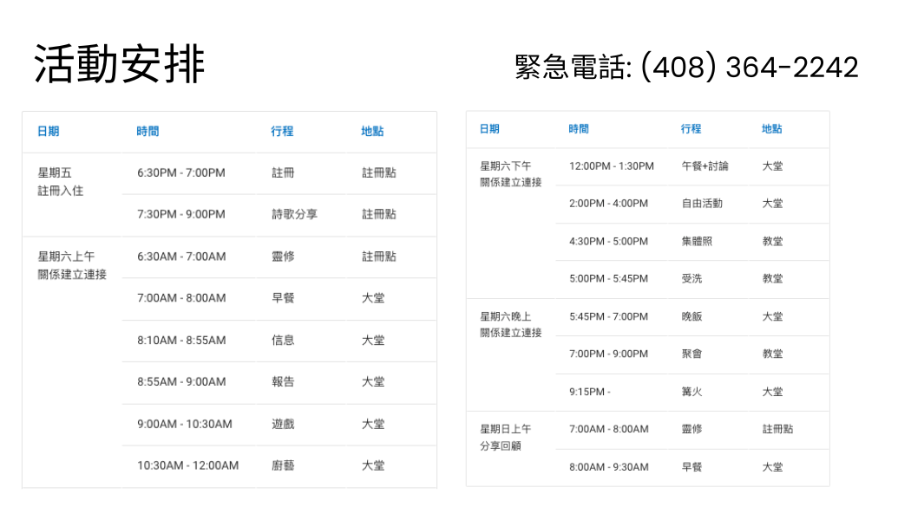
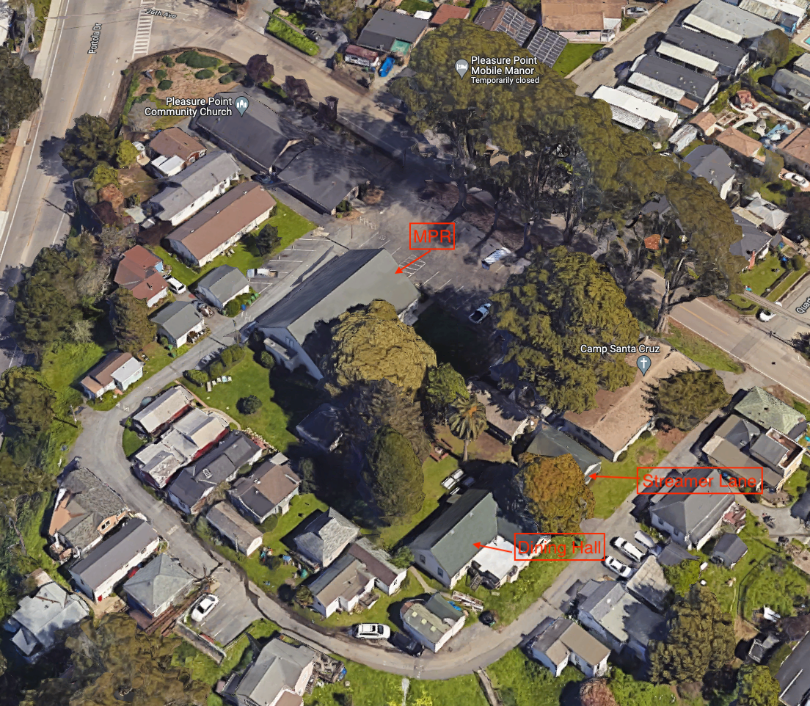

---
hide:
  - footer-navigation
  - navigation
  - footer
---

# 退休會

## 註冊文檔任務 WIP
- [ ] 銘牌
    * [ ] 需要打印銘牌嗎，還是只有網站就好？
    * [x] 如果需要，1）可以正面知道隊友信息，2）反面是基本安排
- [ ] 文檔
    * [ ] 地圖信息，標註 **大堂**，**教會**，**入住房屋**
    * [x] 詳細活動安排。 
    * [ ] 需要打印？網頁形式？
- [ ] 註冊當日
    * [ ] 統計人數
    * [ ] 派發T-shirt，活動材料

### 銘牌

| 銘牌正面      | 銘牌正面      | 
| -------- | -------- |
|{ width="400" } | { width="400" }

## 主題
同心合一  TOGETHER IN ONE
> 要 照 所 安 排 的 ， 在 日 期 滿 足 的 時 候 ， 使 天 上 、 地 上 、 一 切 所 有 的 都 在 基 督 裡 面 同 歸 於 一 (以弗所书 1：10 )
> 
> That in the dispensation of the fulness of times he might gather together in one all things in Christ, both which are in heaven, and which are on earth; even in him. (Ephesians 1：10 )

## 地點
Camp Santa Cruz

631 26TH AVE, Santa Cruz, CA 95062

## 地圖

## 活動安排

#### 安排項目

| 日期      | 時間      | 行程                  | 地點      |主持人/聯絡人  | 詳情  |
| -------- | -------- | -------------------- |---------- | ------------- |------------- |
|星期五   註冊入住 | 6:30PM - 7:00PM| 註冊  | 註冊點 | Peng, Della  | <ul><li>註冊報名，拿到T-shirt和資料</li><li>沒有晚飯，夜宵零食放置在xxx</li></ul>
|_^ _| 7:30PM - 9:00PM | 詩歌分享  |  註冊點 | RongFei, Xinan  | _^ _
|星期六上午   關係建立連接  | 6:30AM - 7:00AM | 靈修  |  註冊點 | Steven  | Optional
|                       | 7:00AM - 8:00AM | 早餐  |  大堂  |  ______ &#20; | 按照小組
|                       | 8:10AM - 8:55AM | 信息  |  大堂  |  ______ &#20; | 敬拜：同心合一
|                       | 8:55AM - 9:00AM | 報告  |  大堂  |  Tracy | 總結週六行程
|                       | 9:00AM - 10:30AM | 遊戲  |  大堂  |  嘉玲, Shirley | 破冰遊戲
|_^                    _| 10:30AM - 12:00AM | 廚藝  |  大堂  |  蔣甲 | 小組一起做佳餚，小組互評得勝者
|星期六下午   關係建立連接 | 12:00PM - 1:30PM | 午餐+討論  |  大堂 | ______ &#20;  | 按照小組
|                       | 2:00PM - 4:00PM | 自由活動  |  大堂  | Jason, Tracy | <ul><li>籃球</li><li>Hiking</li><li>午休</li></ul>
|                       | 4:30PM - 5:00PM | 集體照  |  教堂  |  天明 | ______ &#20;
|_^                    _| 5:00PM - 5:45PM | 受洗  |  教堂  |  長老 | ______ &#20;
|星期六晚上   關係建立連接 | 5:45PM - 7:00PM | 晚飯  |  大堂 | ______ &#20;  | <ul><li>以小组为单位</li><li>讨论准备的问题</li><li>去海边看日落(optional)</li></ul>
|                       | 7:00PM - 9:00PM | 聚會  |  教堂  |  ______ &#20; | <ul><li>敬拜</li><li>Quick topic speech</li><li>小组为单位上台表演</li></ul>
|_^                    _| 9:15PM  | 篝火  |  大堂  | RongFei  | <ul><li>分享最喜欢的诗歌</li><li>一起唱歌</li><li>夜宵</li></ul>
|星期日上午   分享回顧  | 7:00AM - 8:00AM | 靈修  |  註冊點 | Steven  | Optional
|                       | 8:00AM - 9:30AM | 早餐  |  大堂  |  ______ &#20; | 按照小組
|                       | 9:30AM - 12:00PM | 敬拜  |  教堂  |  ______ &#20; | 敬拜：同心合一
|_^                    _| 12:30PM  | 結束  |  ______ &#20;  |  ______ &#20; | ______ &#20;

#### 注意事項
| 類別      | 條目      |
| -------- | -------- |
|出發前 | 衣： 查看週末天氣，準備好大衣（晚上天寒），太陽鏡 
|      | 食： 週五不準備晚飯，需要大家自行解決
|      | 住： 帶上洗漱用品，自己的水杯
|_^   _| 行： 盡量早些出發，避免路上車輛過多
|退休會活動 | 如身體不適或其他情況，缺席活動，請告訴小組長 
|      | 青少年，兒童聯繫人方式：xxx
|      | 發現有遺失物品，交予活動委員會，負責失物認領
|_^   _| 小組長即時會報隊員緊急情況給活動委員會
|離開營地 | 檢查手機，錢包等容易丟失物品 
|_^   _| 安全開車，平安到家

### 小組長任務清單
| 類別      | 條目      |
| -------- | -------- |
|出發前 | 培訓？
|退休會活動 | 帶領問題討論
|_^   _| 會報緊急情況